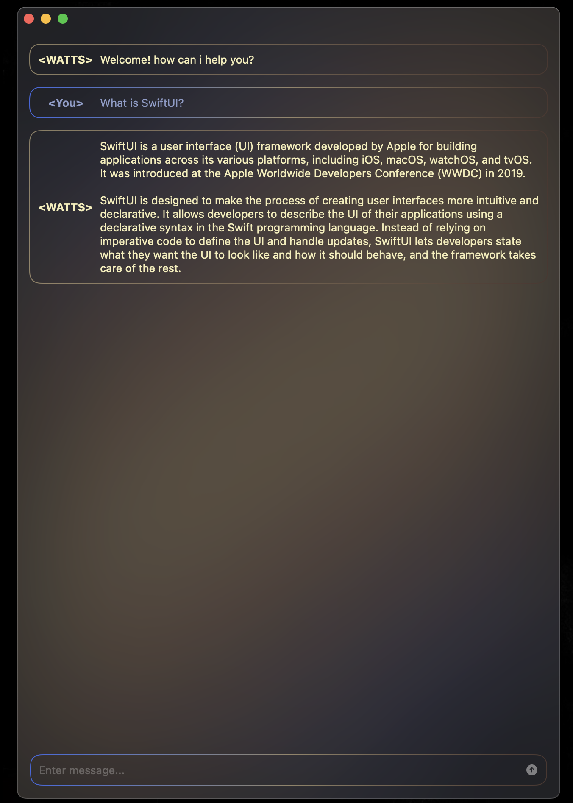

# WATTS

Wisdom Accumulated Through Text Synthesis

A wrapper around [llama.cpp](https://github.com/ggerganov/llama.cpp) & [LLM.swift](https://github.com/eastriverlee/LLM.swift), allowing you to easily swap between llm models on macOS.

- A tribute to the late great Alan Watts.
